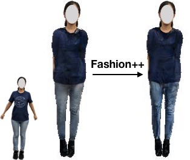
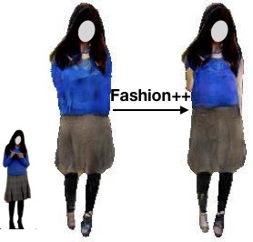
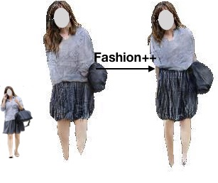

# Fashion++: Minimal Edits for Outfit Improvement
[Wei-Lin Hsiao](http://www.cs.utexas.edu/~kimhsiao/),
[Isay Katsman](https://vision.cornell.edu/se3/people/isay-katsman/)\*,
[Chao-Yuan Wu](https://www.cs.utexas.edu/~cywu/)\*,
[Devi Parikh](https://www.cc.gatech.edu/~parikh/),
[Kristen Grauman](http://www.cs.utexas.edu/~grauman/)<br/>
In ICCV 2019.  [[paper]](https://arxiv.org/abs/1904.09261)


## Installation
This project is tested on Ubuntu 18.04, with python 3.6.4, pytorch 0.4
* Install pytorch >= 0.4 following instructions from https://pytorch.org/
* Install python library dominate
```
pip install dominate
```
* Install python library opencv
```
pip install opencv-python
```
* Clone this repo:
```
git clone https://github.com/facebookresearch/FashionPlus.git
```
## Demo
1. Download pretrained models from:

   | Model | file name   |                           link                                |
   |-------|-------------|---------------------------------------------------------------|
   | cGAN  | latest_net_E.pth|[model](https://dl.fbaipublicfiles.com/FashionPlus/generators/latest_net_E.pth)|
   | cGAN  | latest_net_G.pth|[model](https://dl.fbaipublicfiles.com/FashionPlus/generators/latest_net_G.pth)|
   | cGAN  | latest_net_D.pth|[model](https://dl.fbaipublicfiles.com/FashionPlus/generators/latest_net_D.pth)|
   | cGAN  | train_avg_features.p|[features](https://dl.fbaipublicfiles.com/FashionPlus/generators/train_avg_features.p)|
   | VAE   | latest_Decoder.pth|[model](https://dl.fbaipublicfiles.com/FashionPlus/VAE/latest_Decoder.pth)|
   | VAE   | latest_Separate_encoder.pth|[model](https://dl.fbaipublicfiles.com/FashionPlus/VAE/latest_Separate_encoder.pth)|
   | VAE   | latest_Together_encoder.pth|[model](https://dl.fbaipublicfiles.com/FashionPlus/VAE/latest_Together_encoder.pth)|
   | classifier | 120_classifier.pth|[model](https://dl.fbaipublicfiles.com/FashionPlus/classifier/120_classifier.pth)|

   Place all but `120_classifer.pth` in `checkpoint/humanparsing/`.\
   Place `120_classifier.pth` in `checkpoint/`.

2. Prepare images in `datasets/images/`.\
   Prepare corresponding segmentation masks in `datasets/labels/`.\
   **_Note: Our pretrained models depend on the label taxonomy it was trained on, which is from: [HumanParsing-Dataset](https://github.com/lemondan/HumanParsing-Dataset)_**

```
# label index:  segment name
0            :  null
1            :  hat
2            :  hair
3            :  glasses
4            :  up(per clothing)
5            :  skirt
6            :  pants
7            :  dress
8            :  belt
9            :  r-shoe
10           :  l-shoe
11           :  face
12           :  r-leg
13           :  l-leg
14           :  r-arm
15           :  l-arm
16           :  bag
17           :  scarf
```
   **Segmentation labels need to be converted into the above mapping in order to work with FashionPlus.**

3. Prepare input data for models:\
   _Change_ `ROOT_DIR` _in script to FashionPlus' absolute path on your system._
```
cd preprocess
./run_prepare_data.sh
```

4. Encode input images into latent codes:\
   _Change_ `ROOT_DIR` _in script to FashionPlus' absolute path on your system._
```
cd preprocess
./encode_shape_texture_features.sh
```
5. Perform edit and generate the changed output:\
   _Change_ `ROOT_DIR` _in script to FashionPlus' absolute path on your system._\
   Specify options:

   * UPDATE_FNAME: image file's name to be edited
   * UPDATE_TYPE: could choose to update only shape, or only texture, or both
   * AUTO_SWAP: whether to let the editing module automatically decide which garment to change; if specified, SWAPPED_PARTID will have no effect
   * SWAPPED_PARTID: explicitly specify which garment to swap out; here our mapping is top=0, skirt=1, pants=2, dress=3
   * MAX_ITER: if the updating module's stop criterion is among reaching the maximal iteration, then specify the maximal value here
   * STEP_SZ: amount of edit performed in each iteration; the larger the step size, the more significant the change is
```
./scripts/edit_and_visualize_demo.sh <UPDATE_FNAME> <UPDATE_TYPE> <AUTO_SWAP> <SWAPPED_PARTID> <MAX_ITER> <STEP_SZ>
```
   Output image results will be saved to `classification/data_dict/shape_and_features/results/demo/images/`.

### Example 1


Automatically decide where to change, and change both shape and texture
```
cd classification/data_dict/shape_and_feature/
./scripts/edit_and_visualize_demo.sh 18.jpg shape_and_texture True 0 10 0.25
```
### Example 2


Specify to change the top, and change both shape and texture
```
cd classification/data_dict/shape_and_feature/
./scripts/edit_and_visualize_demo.sh 3.jpg shape_and_texture False 0 10 0.05
```
### Example 3


Specify to change the top, and change only the shape
```
cd classification/data_dict/shape_and_feature/
./scripts/edit_and_visualize_demo.sh 4.jpg shape_only False 0 10 0.25
```
### License
FashionPlus is CC-BY-NC 4.0 licensed, as found in the LICENSE file.

## Citation
If you find this useful for your research, please consider citing:
```
@inproceedings{hsiao2019fashionplus,
  title={Fashion++: Minimal Edits for Outfit Improvement},
  author={Hsiao, Wei-Lin and Katsman, Isay and Wu, Chao-Yuan and Parikh, Devi and Grauman, Kristen},
  booktitle={In Proceedings of the IEEE International Conference on Computer Vision (ICCV)},
  year={2019}
}
```

## Acknowledgements
This code borrows heavily from [pix2pixHD](https://github.com/NVIDIA/pix2pixHD) and [BicycleGAN](https://github.com/junyanz/BicycleGAN).
